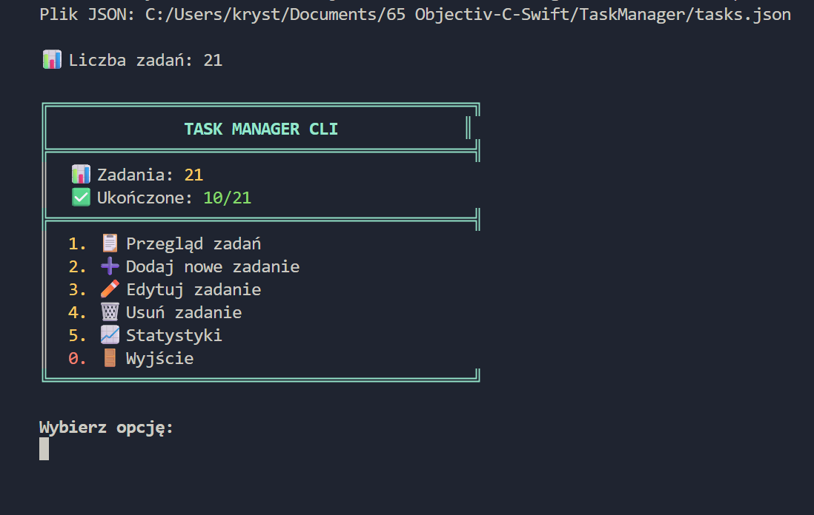
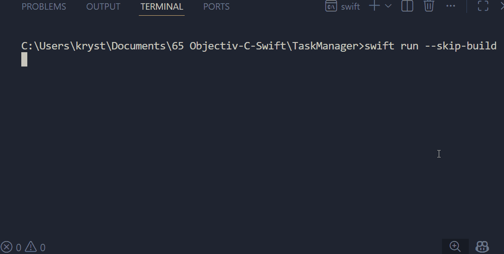

# SwiftTasker - Swift CLI

Lightweight, modular **task management system built in Swift**, designed with clean architecture and persistent storage.

>  Not just a CLI app - a foundation for scalable task management systems.

---
## Example UI (CLI)


##  Demo



---

##  Key Features

-  Full **CRUD operations** for tasks  
-  Persistent storage using **JSON (no data loss between runs)**  
-  Structured **menu-driven CLI interface**  
-  Task organization:
  - categories
  - priorities
  - completion status  
-  Built-in **statistics engine**  
-  Filtering & sorting capabilities  
-  Clean separation of concerns (Models / Services / UI)

---

## Engineering Highlights

### 🔹 Separation of Concerns
- Models → data structures  
- Services → business logic  
- UI → CLI interaction  
- Utils → persistence layer  

### 🔹 Data Persistence Layer
Custom JSON storage handler:
- automatic save/load  
- decoupled from business logic  
- easily replaceable (e.g. database)

### 🔹 Extensibility-first Design
Architecture allows easy migration to:
- REST API backend  
- GUI (SwiftUI / Web)  
- multi-user system  

---
### Project Structure
```
SwiftTasker/
├── Models/
├── Services/
├── UI/
├── Utils/
└── main.swift
```
---
### Tech Stack
| Layer| Technology | 
| :---  | :--- |
| Language | Swift 6.x | 
| Build | Swift Package Manager | 
| Storage | JSON | 
| Interface | CLI | 
---
### Example Workflow
```
User → CLI Menu → Service Layer → JSON Storage → File System
```
--- 
### Sample Output
```
📊 Tasks: 5
✅ Completed: 2/5

1. View Tasks
2. Add Task
3. Edit Task
4. Delete Task
5. Statistics
0. Exit
```
---
### Data Model
```json
{
  "id": 1,
  "title": "Build TaskManager",
  "category": "Development",
  "priority": "High",
  "isCompleted": false
}
```
--- 
### Running the Project

```bash
swift build
swift run --skip-build
```
---
### Design Decisions

**Why CLI?**
- focuses on logic, not UI noise
- faster iteration
- ideal for demonstrating architecture

 **Why JSON?**
- zero setup
- portable
- human-readable
- perfect for MVP
---
### Scalability Path

This project can evolve into:

- REST API (Node / Laravel / Swift backend)
- Desktop App (SwiftUI)
- Web App (React + API)
- Cloud-based task manager
---
### What This Project Demonstrates
- practical software architecture
- real-world data flow design
- clean and maintainable code structure
- ability to build extendable systems
---
### Author

Krystian Marciniak\
Computer Science Student

---
### Recruiter Notes

This project intentionally prioritizes:

- clarity over complexity
- architecture over UI
- extensibility over shortcuts

It reflects how I approach building scalable systems from simple foundations.
---
### Suggested Enhancements (Next Steps)
- API layer (Express / Laravel / Vapor)
- authentication system
- multi-project support
- database integration (PostgreSQL)
- Dockerization
---
### Status

- Functional
- Modular
- Ready for extension
---
### Final Thought

Simple system. Clean architecture. Real-world thinking.